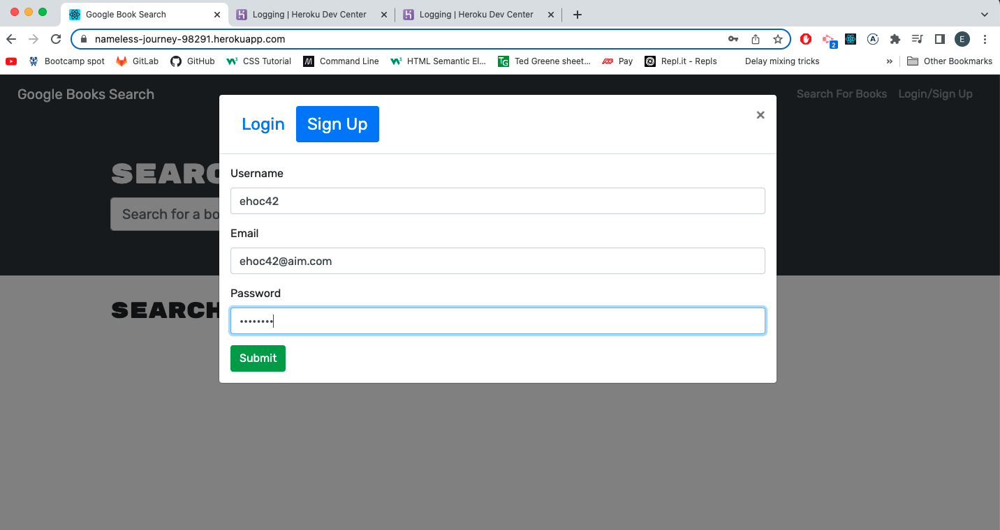
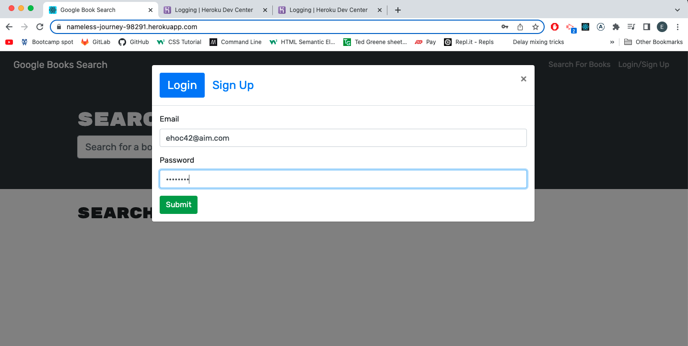
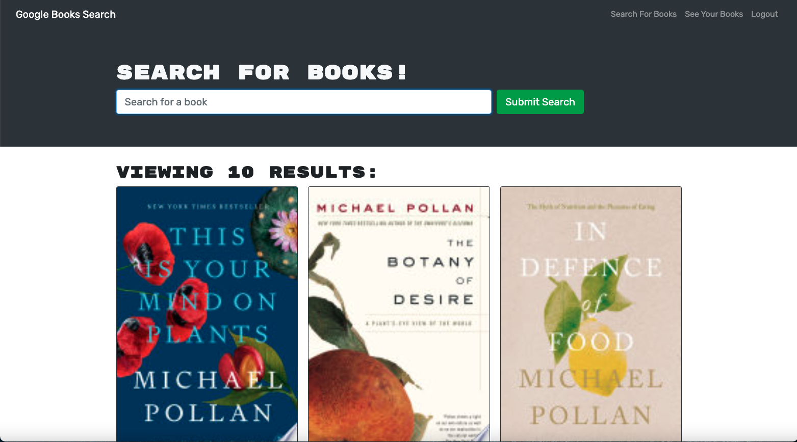
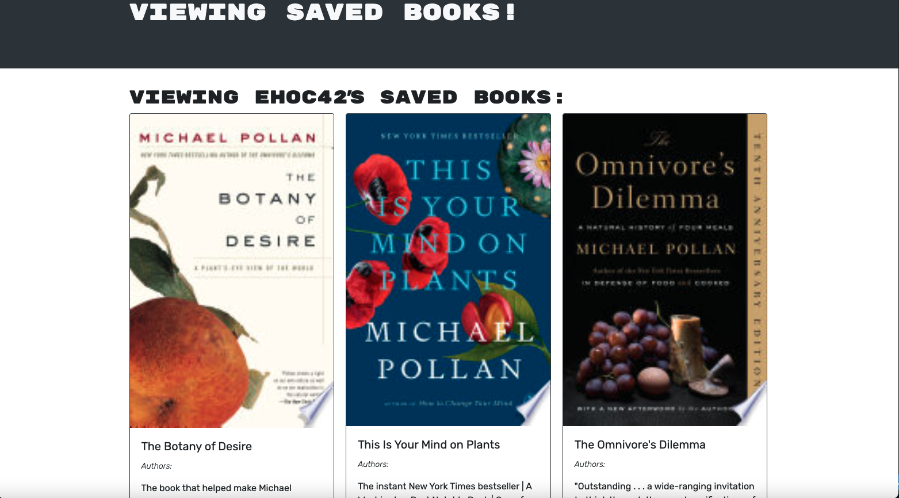

# MERN Book Search Engine

## Description

This is a Book Search Engine built with a React Front end and a Mongoose back end interfaced with a GraphQL API. The search engine was refactored from a Restful API to a GraphQL API using Apollo server. 

The home page of the app allows you to search for books. The search results are populated using the Google Books API. You can search for any book or author you want, and browse the results. 

You can sign up or log in by clicking the link on the top right of the screen. Once you are logged in, you are able to search for books and click "Save This Book!" which saves the book to the collection associated with your user. You can than see your saved books, if you are logged in, by clicking "See Your Books" on the top right of the screen. Then from that page you can delete books from your collection by clicking "Delete Book". 

## Deployed Link
https://still-tundra-52545.herokuapp.com/

## Screenshots

